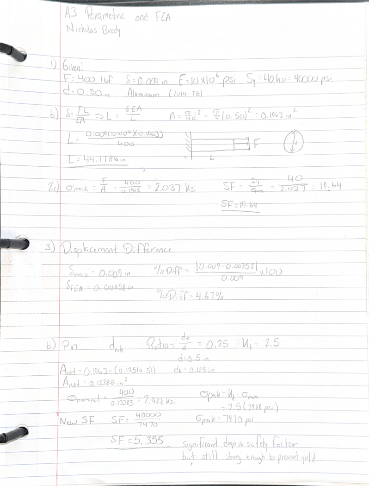
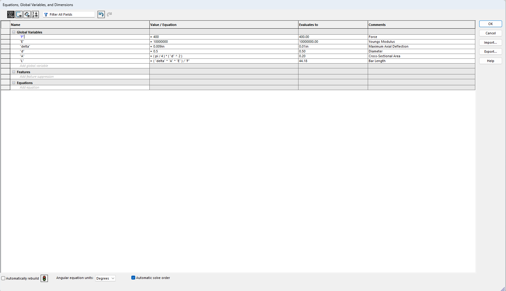
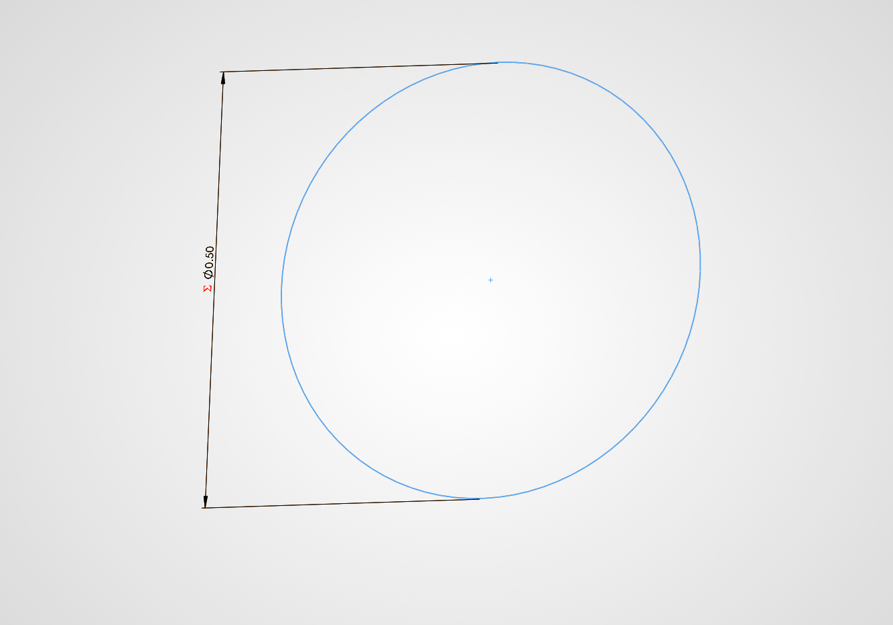
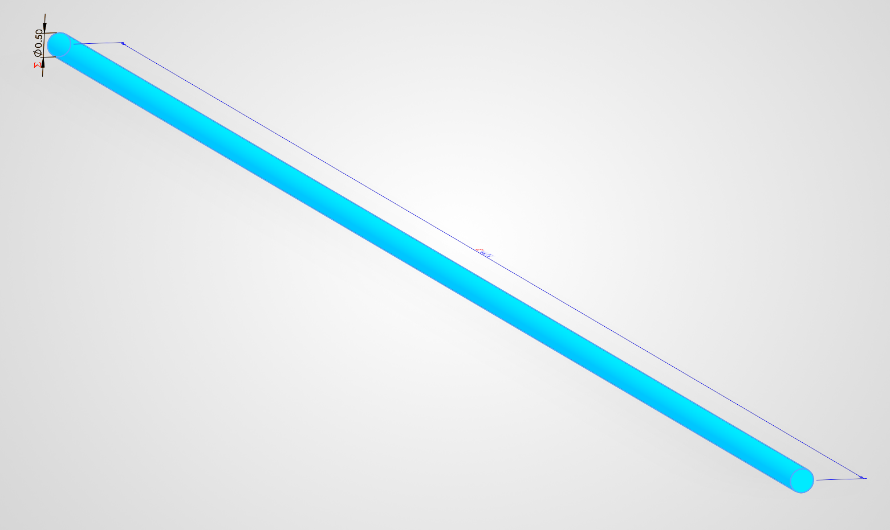
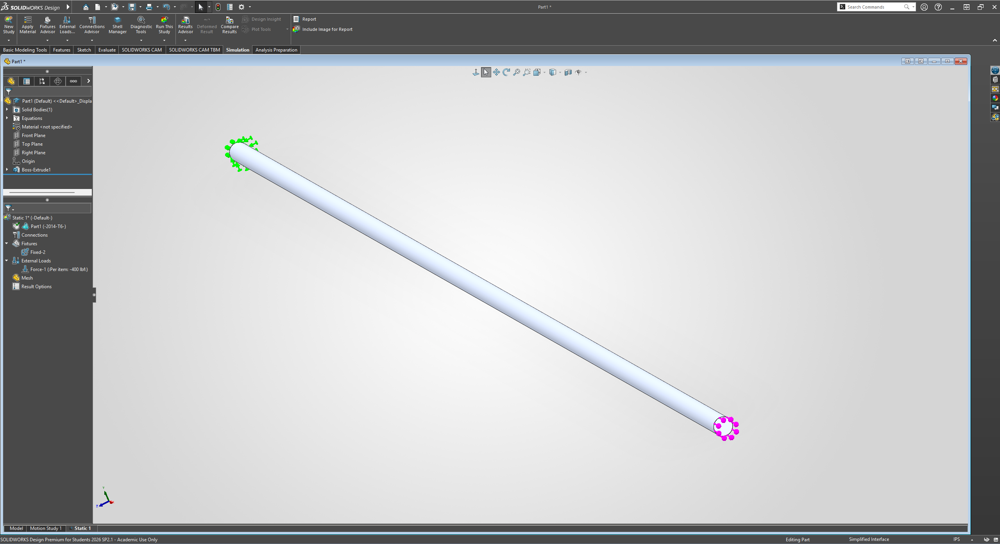
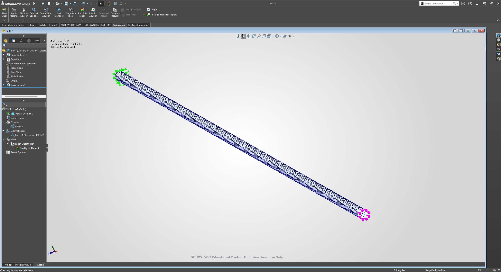
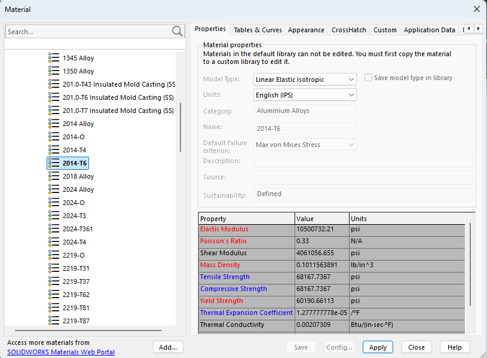
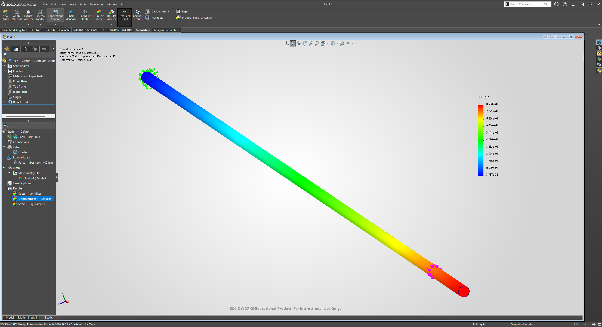
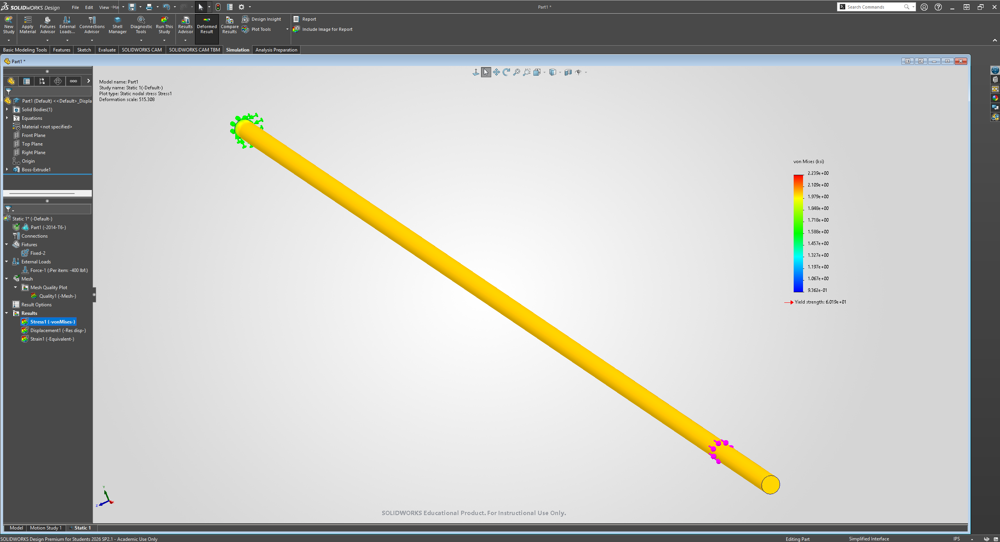

# A3 – Parametric Design and Finite Element Analysis

## 1 - Objective
This assignment's objective is to use finite element analysis (FEA) to enhance our knowledge around beam design. We were tasked with designing a straight bar with a circular cross section. Given certain criteria, such as materials, load, and size, we hand-calculated the length and diameter of our bar. To verify our calculations, we then made our beam in a parametric CAD software before running an FEA. This assignment introduced the concept of FEA as well as defining global variables and equations. Such variables make it easier to ensure CAD calculations match hand calculations. 

Above is a scan of my notebook showing all of the hand calculations. It shows all three steps. 1) is a simple parametric calculation, using the given deflection to find the length. I chose a Young's Modulus of E = 10x106 and a diameter of 0.50 in. Using this diameter, I plugged my values into the area of a circle formula which yielded a value of 0.1963 in2. Now, I have all of the components of the axial deformation equation, necessary to find the length. After some rearranging, I can plug all the values in and solve for the length of the bar. I found that the length of the bar was 44.18 in.

For problem 2), I plugged the force and the previously found cross-sectional area into the stress equation. That results in a nominal stress value of 2.037 ksi. Comparing this to the given yield strength of 40 ksi, the bar has a safety factor of 19.64. In its current design, this bar can withstand much more load than it currently is.

At the bottom of the page are my calculations for problem 3. This problem only required me to compare the deflection estimated in the FEA and the deflection I was given. I will expand upon these findings in the third section of the page.

## 2 - SolidWorks Parametric Design

These two images, specifically the one on the top, are important to this assignment. This was my first time using the equations and variables features for a CAD project. Rather than calculating the length and cross-sectional area by hand, I was able to input my parameters in the program which then calculated those values. I find this to be a useful feature as it removes a possible way for human error to interfere with the process. The image on the bottom shows the sketch that preceded the extruded cylinder; note that the diameter of the sketch is set to the value of my "d" variable. 

 

This image shows the final extrusion. Similar to the sketch, the length of this item is determined by the value stored in the "L" variable. To match the original hand sketches, the CAD sketch was built off of the right plane meaning that the extrusion was further to the "right direction" which is also the positive x direction.

 

Now that the extrusion was complete, I focused on preparing for the simulation. Above shows where the fixed wall constraint and the distributed load were placed on to the cylinder. The fixed constraint was placed on the leftmost end of the cylinder. The distributed load was placed on the rightmost end of the cylinder; this load was set to 400 lbf. Additionally, I included a picture of the mesh placed on the cylinder.

 

The final step before running the simulation was setting the model material to aluminum. I chose Aluminum 2014-T6 mainly because it has a similar Young's Modulus to the one I used to calculate.

 

Shown above the the two simulation maps that I generated. The displacement/deflection map is the top image, the von Mises stress map is the bottom image. The displacement simulation is the most interesting as it clearly shows how much more displacement the load-bearing end of the bar experienced. The von Mises map seems to depict an evenly balanced amount of surface stress except for at the wall end.

## 3 - Design Reflection
As seen before, the given maximum deflection was 0.009 in. According to the FEA, the maximum deflection should be 0.00858 in. Calculating for percent difference results in a difference of 4.67%. There are a few possible explanations for this discrepancy, the simplest is that my hand calculations are not completely factored in for the aluminum alloy used in the CAD. I calculated for a Young's Modulus of 10x106 psi whereas the CAD was factoring in a value of 10.5x106. Another possible cause of discrepancy is the mesh density. The computer can only approximate to a certain degree and I did not set the mesh to be as detailed as possible.

I would tend to trust the hand calculations over the FEA as there are less inherent limitations like approximation and mesh density. Both aspects rely on the user's data being accurate, but hand calculations are simpler to troubleshoot and correct. FEA can still be used as a visualization tool when the user inputs are correct.

## 4 - Communicate

I spent about 8 hours spread over a couple of days while completing this project. Initially, I tried to create my CAD model in PTC Creo Parametric but I switched over to SolidWorks to match the lecture information. I wanted my process and results to correspond with what I had learned in the lecture as well as to ensure my process was correct.

