# A4 - Motor Mount

## Objective
For this project, students were presented with a brushed 24V DC Gear Motor. We were tasked with designing a simple mount comprised of two adjoining parts. We based our calculations on cantilever beams and separated the beams at the 90-degree joint. We were told to neglect the motor's weight, so we were given a 300 N force, a set of materials, and a maximum deflection to design our product parametrically. The material options were PLA, ABS, and PETG, all of which are standard 3D printing filament materials. I chose PLA because it has a greater modulus of elasticity and therefore is more resistant to deflection. Using MatWeb, I found the average yield strength of PLA to be 45.2 MPa; additionally, the average Modulus of Elasticity of PLA is 2.35 GPa (2350 MPa).
We also had to make a few assumptions regarding certain dimensions on our product. The length and thickness of each beam was at our discretion. Feature 1, the first part, was a simpler part to design due to it being a horizontal beam. Feature 2 had an extra caveat; I had to account for a certain amount of the beam not being fixed to the "wall". At the end of our calculations, we had to include holes that could be used to fix the motor to the mount.

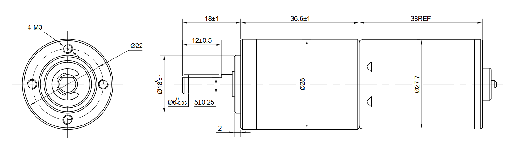
 
<em>Motor Diagram</em>

## Feature 1

For my feature 1 design, I chose a length of 35 mm and a base width of 30 mm. I chose these numbers based on the motor's 22 mm diameter. As the driving face of the motor will be fixed to Feature 1, it is logical to set these dimensions a little larger than the diameter. With these dimensions set, I can begin to calculate. Shown below is the full page of calculations for Feature 1. The first step was drawing the Free Body Diagram and consequently finding the reaction forces. There is an additional 18 mm length added on to the bottom of the beam. That is for the motor shaft, which is what the 300 N force is acting upon. Using this length and the given force, I found the Moment to be 5400 N * mm. Now I am all set to calculate for the height of this beam. I rearranged the max stress and max deflection equations to solve for height. The max stress equation yielded a height of 8.47 mm. The max deflection equation yielded a height of 12.3 mm. As 12.3 is greater than 8.47, that height becomes the governing height for the beam. The final step for feature 1 was plugging the new height into an area equation to find the cross-sectional area: I found this to be 369 mm2.

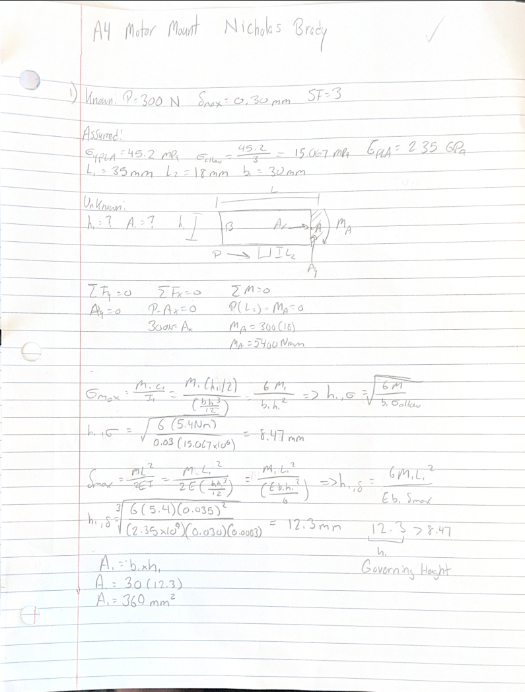

## Feature 2

As stated before, Feature 2 was slightly more complicated to design. To set the vertical length for the beam, I used the total length of the motor, 74.6 mm, in conjunction with the height of Feature 1. These added together result in 86.9 mm, which I rounded up to 90 mm. In the FBD, I still include the 18 mm shaft length to base the location of the 300 N force on. Using all of my calculated lengths, I find the Feature 2 moment; I multiplied the 300 N force by the sum of the shaft length and the total length (300 N * (90 mm + 18 mm)) = 32400 N * mm. Now is time for the caveat mentioned earlier. For Feature 2, we are assuming the only free moving length of the beam is the lower part which is partially fixed to Feature 1. The majority of the upper beam is fixed to a "wall" and can not move or deflect. To find this length, I took the Feature 1 height (12.3 mm) and added 25 mm for clearance from the bolts. Because the bolts cannot be allowed to undergo any deflection, it was important to allow a significant clearance to prevent it. I used the free length for my next calculations. With the moment and free length, I can plug the relevant values into the stress and deflection equations to find the height. I get a similar result to Feature 1, with the deflection yield being greater than the stress yield. My final Feature 2 height was 23.4 mm, which is slightly greater than 20.7 mm. As I did with Feature 1, I used the height to find the cross-sectional area. The result was 702 mm2. 

At this point in the project, all of my calculations are completed. All that remains is to draw an expected isometric view of the mount and to model it in parametric CAD software. 

  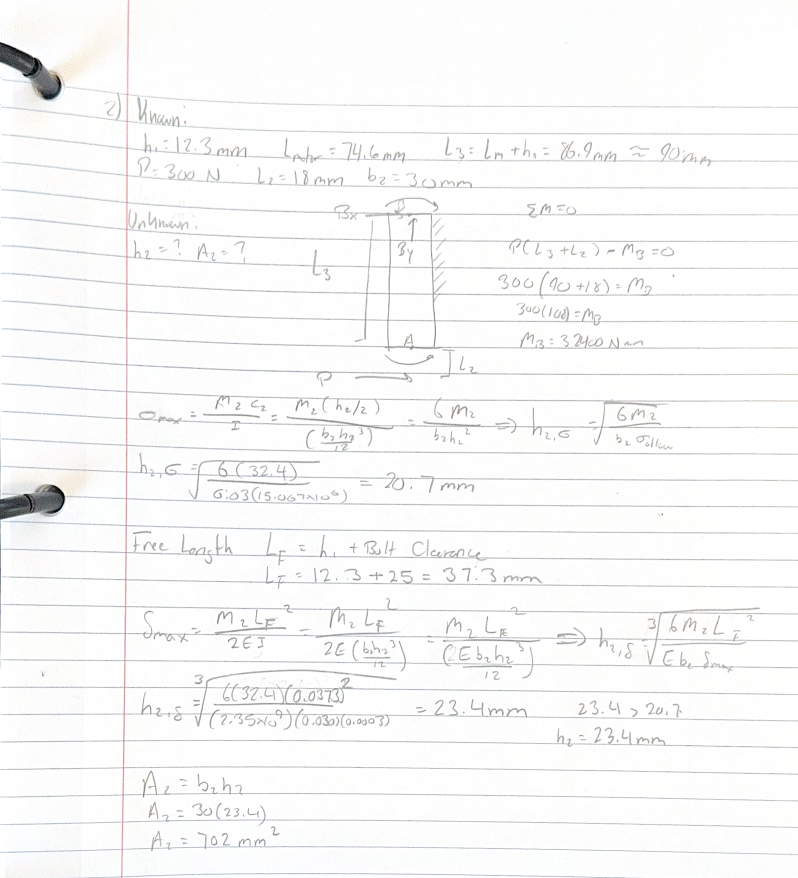

##  Isometric View

  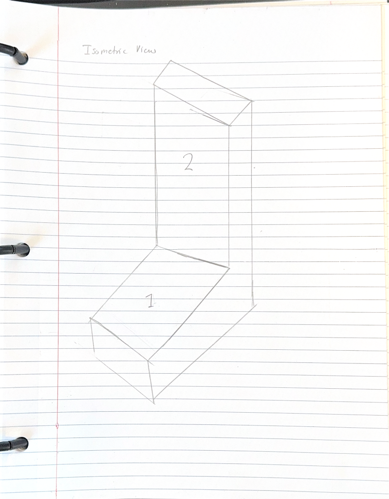

## CAD Modeling

The CAD Modeling portion of the project was relatively easy. With the ability to set variables and equations in the SolidWorks toolbar, extruding the correct dimensions was simple.

  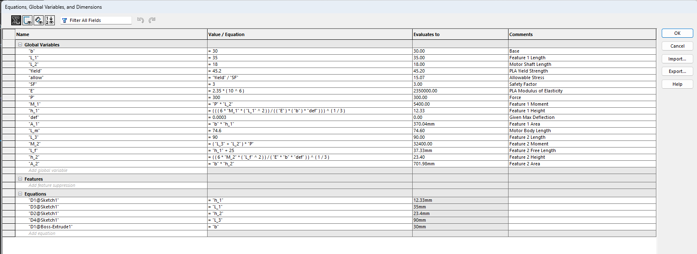

I sketched out the basic L-shape of the mount and used the Smart Dimension feature to set dimensions to my variables.

  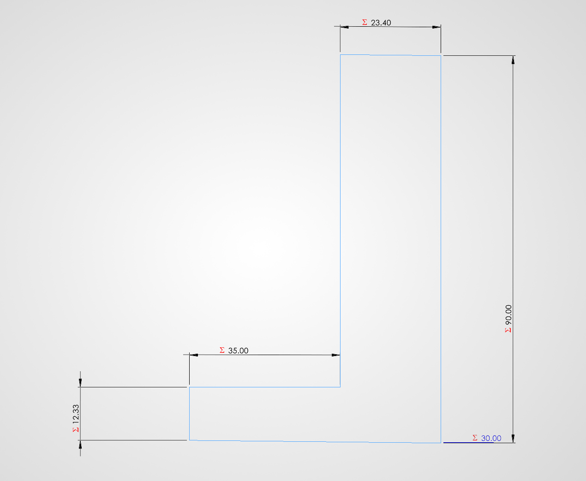
  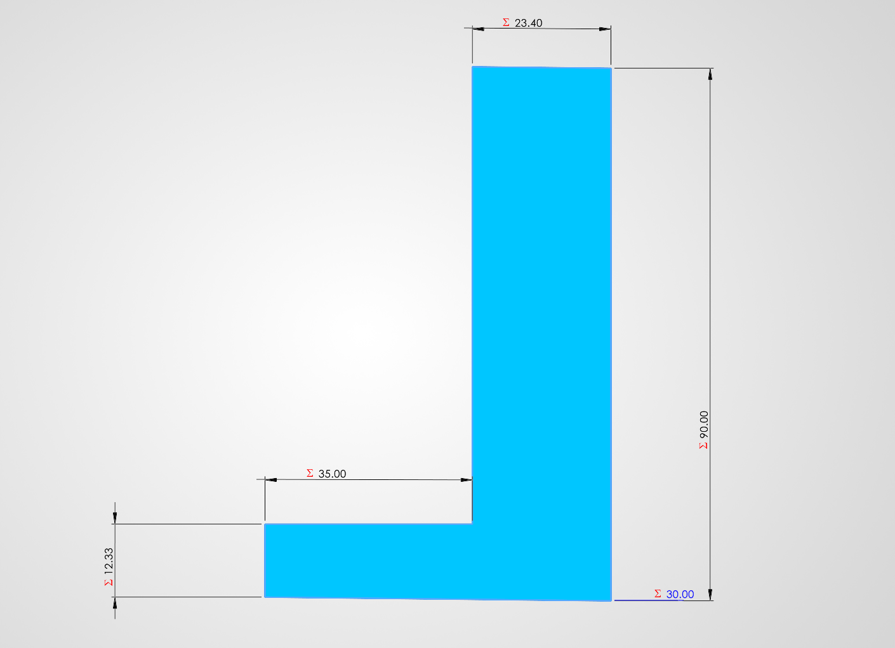
  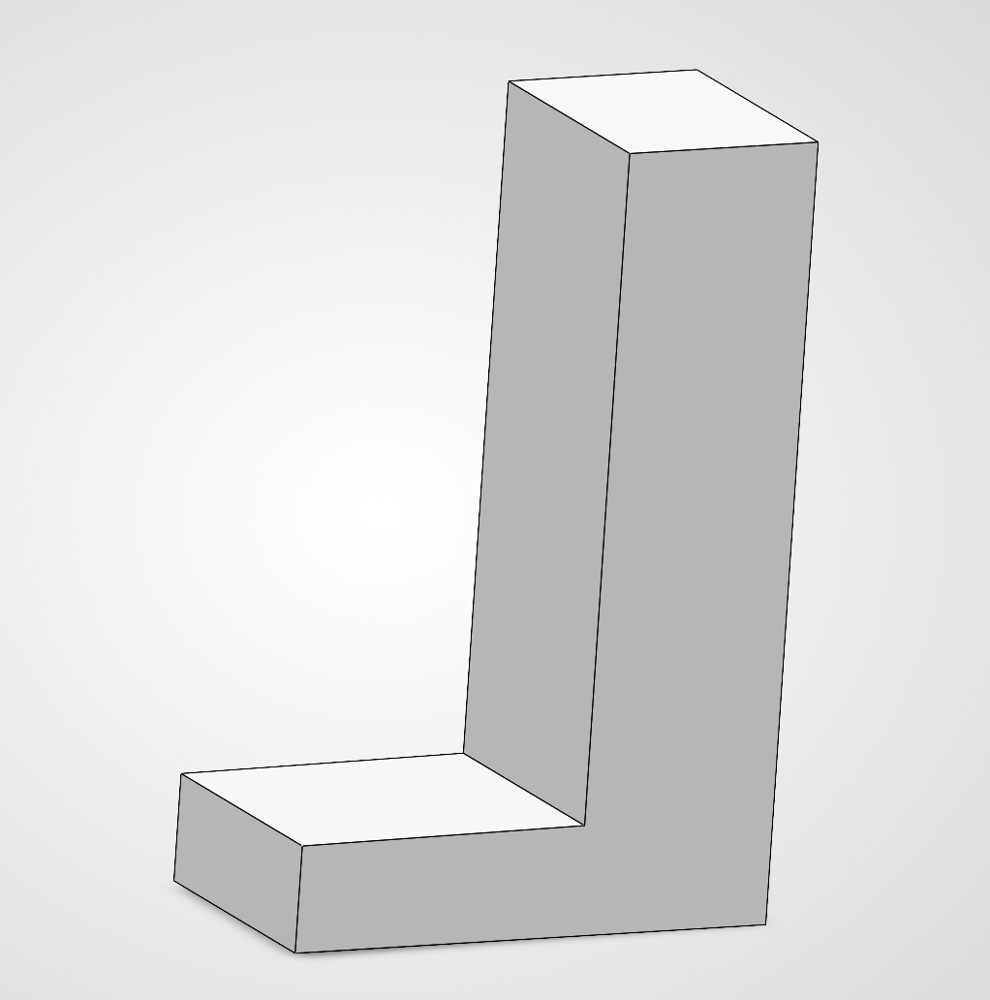

With the basic body extruded, it was time to add the driving face screw holes. We were given the specs of M3 screws that have a 3.4 mm clearance. As defined in the motor diagram, I sketched the 4 screw holes and the shaft hole. Following that, the extrusion was the small 2 mm lip for the motor. All of these small extrusions and holes are based on parts in the motor diagram; they are intended to make the motor sit as well as possible on the mount.

  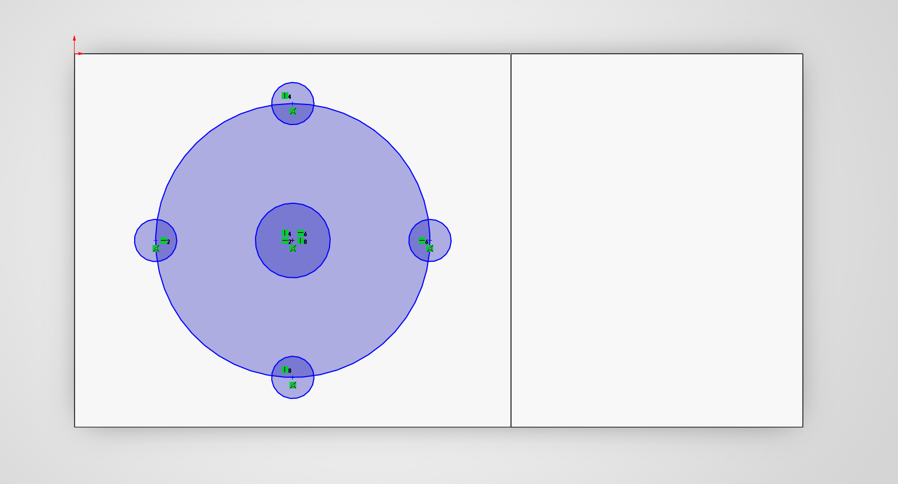
  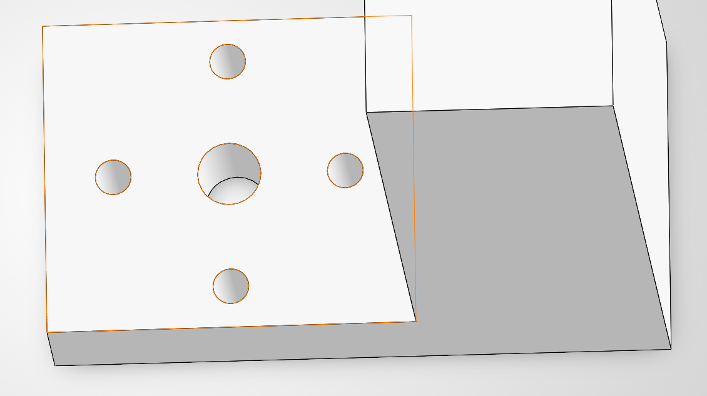
  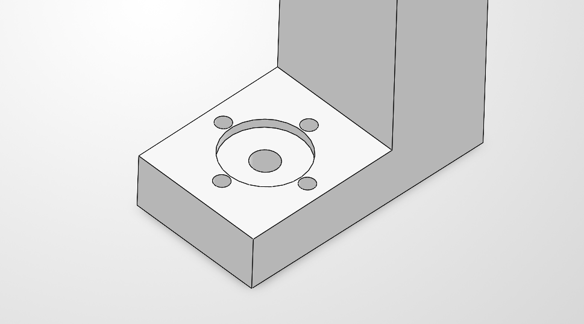

The final step of the CAD model was adding screw holes in Feature 2. Using the same spec of screws, I extruded 4 holes into the inside face of Feature 2. I set each side 7.5 mm from the edges to have an even spread. For the heights of each hole, I set the lower holes to the end of the "free length" which put them 37.3 mm above the base. The upper holes were set 36.6 mm above the lower. This made a nice spread between the two hole sets.

  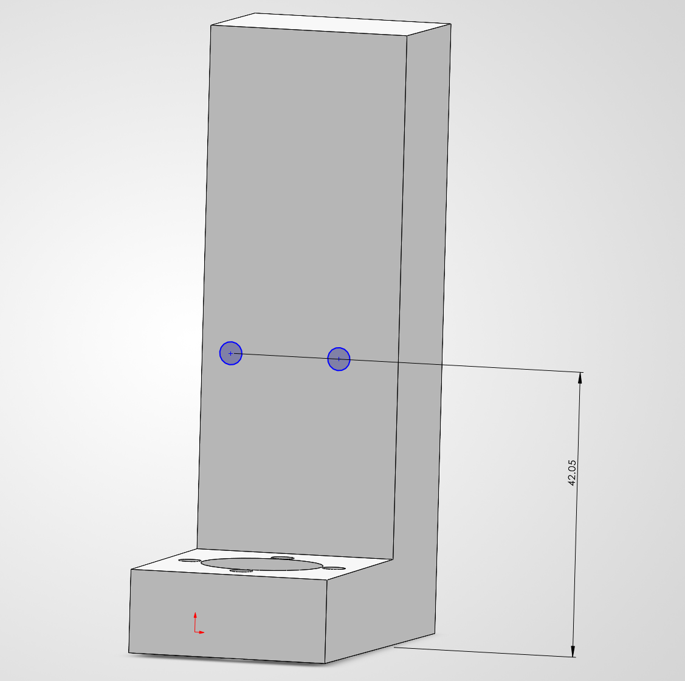
  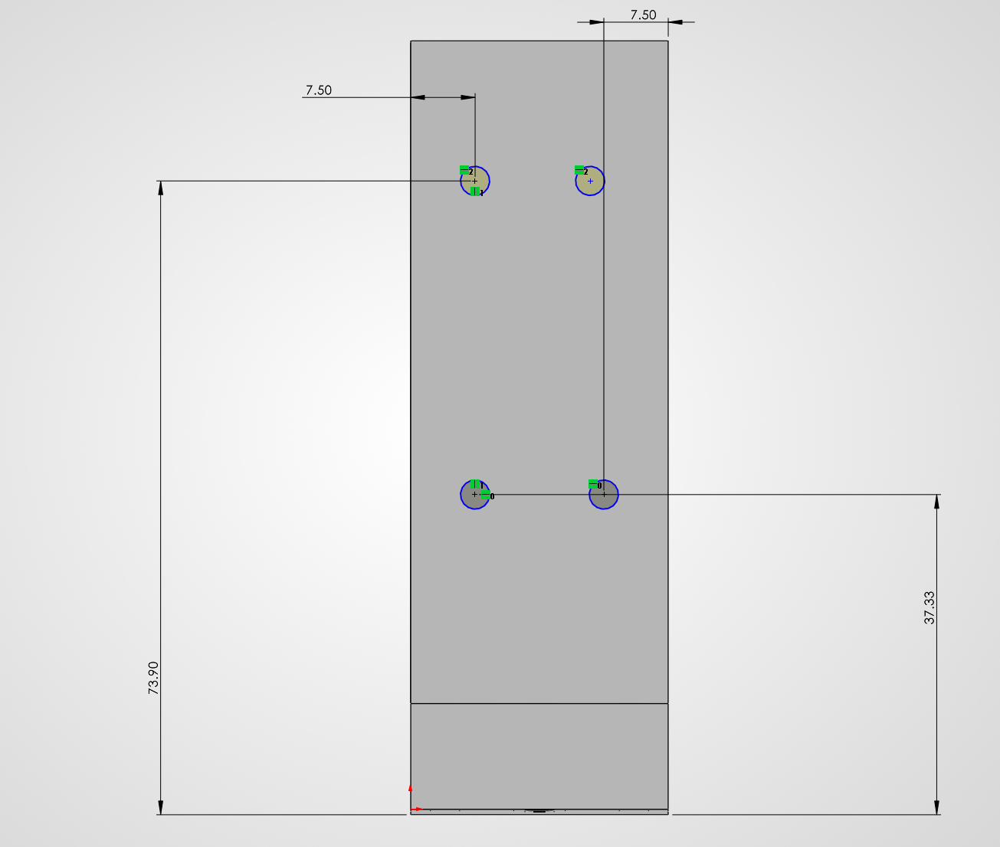
  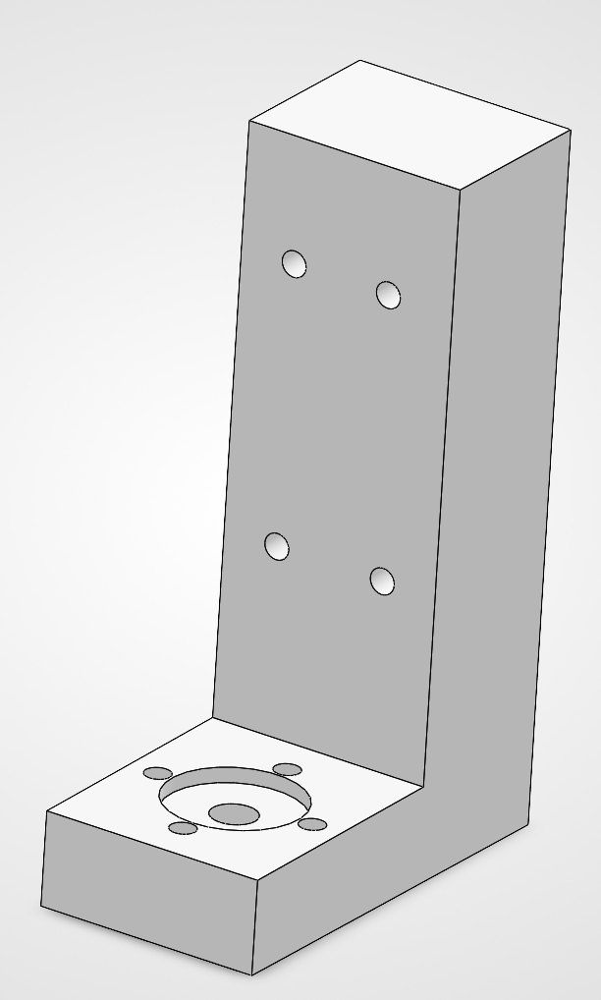 

I spent about 10 hours calculating and designing this model. The most challenging part was figuring out the assumed dimensions for both beams, but specifically Feature 2. 

# Download CAD Model
<a href="a4.SLDPRT">Download my CAD Model</a>
